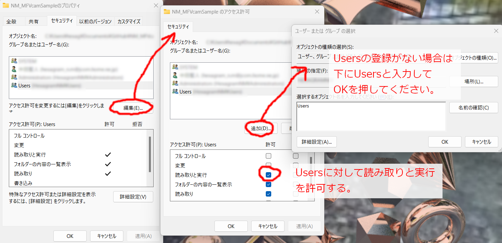

# NM_MFVCamSample

Window11から使用できるようになったMediaFoundationによる仮想カメラのサンプルです。
WinRTのWindowsGraphicsCaptureAPIでキャプチャしたウィンドウを映せるようにしています。

仮想カメラ用のdllを作成するためのソースコードはSimon Mourier氏の
[VCamSample](https://github.com/smourier/VCamSample)のコードを
使わせていただいております。

## 動作環境

* OS: **Windows11**（MediaFoundationの仮想カメラの機能は
Windows11 (Windows Build 22000以降)から追加されたものであるため、
Windows10以前だと動きません。）

* CPU: 13th Gen Intel(R) Core(TM) i7-13700H 2.40 GHz

* RAM: 32.0GB

* GPU: NVIDIA GeForce RTX 4060 Laptop GPU (**DirectX11使用**)

太字の要件を満たしているマシンであれば、動作すると思います。

## 仮想カメラを使用できたソフトウェア

* Windows標準のカメラアプリ

* Discord

* Zoom

* Teams

* [ウェブカメラテスト](https://ja.webcamtests.com/)

## 解説記事（Qiita）
* [MediaFoundationの仮想カメラで、キャプチャしたウィンドウを映してみた](https://qiita.com/HexagramNM/items/52f5442f26dce89d3502)

* [DirectXでテクスチャを別プロセスに共有する](https://qiita.com/HexagramNM/items/5fa74f59f0b7bb4b80e9)

* [DirectXとMediaFoundation仮想カメラとの効率の良い連携](https://qiita.com/HexagramNM/items/66895f843d12e4ebd203)

## やっていること

MediaFoundationの仮想カメラはFrameServerというサービス上で、Local Serviceのアカウントで
動作します。セッション0であるため、ユーザアカウントに表示しているウィンドウのハンドルを
取得することができません。

そこで、ユーザ側のアプリケーションで、キャプチャしたウィンドウの画面を共有テクスチャとして
保存し、FrameServer上の仮想カメラでこの共有テクスチャを参照できるようにしております。
ウィンドウのサイズなどのパラメタもこの方法で転送しております。

共有テクスチャのハンドル作成には
[IDXGIResource1::CreateSharedHandle](https://learn.microsoft.com/ja-jp/windows/win32/api/dxgi1_2/nf-dxgi1_2-idxgiresource1-createsharedhandle)
を使用しております。

共有テクスチャはキャプチャしたウィンドウのサイズに合わせて表示されるよう、Direct3Dで別テクスチャにオフスクリーンレンダリングし、
そのテクスチャをMediaFoundationの仮想カメラの映像サンプルとして渡しております。

## ブランチ

- main... 最新バージョン

- Old_copyTextureToBitmap... オフスクリーンレンダリングをせず、CPU上にテクスチャのピクセルデータをコピーして処理していたころの古いコード。古い記事の参照用に別ブランチで残しております。

## プロジェクト構成

* `NM_CaptureWindow` (C++)... ウィンドウハンドルからウィンドウをキャプチャし、
仮想カメラでアクセスできる共有テクスチャの作成を行うdllです。
`SampleDriverApp`でこのdllが使われます。

    - 仮想カメラの起動も`NM_CaptureWindow`で行っております。

* `VCamSampleSource` (C++)... Media Foundationによる仮想カメラの本体です。
基本的には[VCamSample](https://github.com/smourier/VCamSample)をそのまま使用しておりますが、
以下の部分を変更しております。

    - `FrameGenerator.h/.cpp`... 共有テクスチャを映し出せるように改造しております。
    また、GPU上で共有テクスチャを変形するためのオフスクリーンレンダリングを追加しております。

    - `SpriteShader.hlsl`... 上記のオフスクリーンレンダリングに必要なシェーダコードを追加しております。

    - `MediaStream.cpp`... 仮想カメラの解像度を変更するために`NUM_IMAGE_COLS`,
    `NUM_IMAGE_ROWS`の値を変更しております。
    また、`SetD3DManager`メソッドから不要になった設定を削除しております。

* `SampleDriverApp` (C#)... WPFで作ったサンプルのGUIです。
プログレスバーを適当に動かしております。

    - `NM_CaptureWindow.cs`で`NM_CaptureWindow.dll`にアクセスできるようにしております。

## ビルド方法

1. `NM_MFVCamSample.sln`を開き、ソリューションをビルドします。

    - VisualStudio2022でプロジェクトを作成しております。

    - `NM_CaptureWindow`はビルド後、生成された`NM_CaptureWindow.dll`が
    `SampleDriverApp.exe`のあるフォルダにコピーされるように設定しております。

2. `NM_MFVCamSample`のフォルダに`Users`の読み取りと実行のアクセス権限を付与します。
フォルダのプロパティから設定できます。

    

    - FrameServerが仮想カメラのdllである`x64/[Release or Debug]/VCamSampleSource.dll`
    にアクセスできるようにするため必要です。

3. `RegisterVirtualCamera.bat`の中身を確認した上で、管理者権限で実行し、
ビルドされた仮想カメラをインストールします。

    - Releaseビルドしたものを登録するようにしているので、Debugビルドのものを登録する場合は
    Releaseの部分をDebugに書き換えてください。

    - アンインストールする場合は、`UnregisterVirtualCamera.bat`の中身を確認した上で、
    管理者権限で実行してください。
    こちらもReleaseビルド用になっているので、必要に応じてDebugに書き換えてください。

4. `SampleDriverApp/bin/[Release or Debug]/net7.0-windows/SampleDriverApp.exe`を起動します。

    - 起動するとカメラを使用するアプリケーションのカメラ一覧に
    `NM_Capture_Window_VCam_Sample`が出現します。
    これを選択すると`SampleDriverApp`の画面がカメラ上に表示されます。
